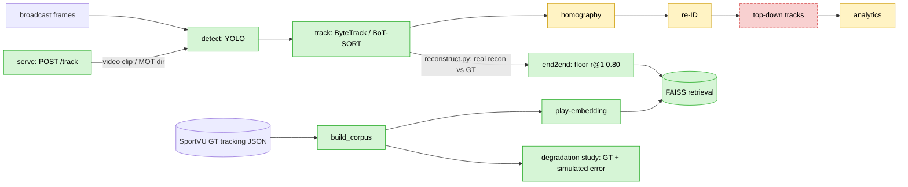

# hooptrack

Reconstruct player-and-ball tracking ("moving dots") from ordinary **NBA broadcast video**, train a
**play-embedding model** on player-and-ball trajectories for similarity retrieval, and wrap both in a
**measured, reproducible eval platform**. The point is the eval rigor and an honest research question, not a
tracking demo:

> **How much do downstream basketball analytics (play retrieval, shot quality) degrade when computed on
> CV-reconstructed tracking versus ground-truth tracking — and which perception errors matter most?**

`hooptrack` is a placeholder name. **Read `docs/writeup.md` first** — the single-document synthesis (the three
findings, the numbers, the honest real/simulated/gated map). See `docs/design-doc.md` for the full spec and
engineering contract (with dated amendments) and `docs/depth-round-notes.md` for the blow-by-blow decision log.
Status: **V1 substantially complete.**
V0 (detection + tracking + eval harness) is done and floors locked. The embedding core, FAISS index, degradation
study, order-robustness study, and a permutation-invariant encoder are done; the perception stages (homography
keypoint front-end, re-ID + jersey OCR, ball, analytics) are built and measured; and the **real tracker output
is now wired into the retrieval core end to end** (reconstructed-vs-GT floor r@1 0.80; an in-domain
broadcast-domain encoder beats it). **Semantic play retrieval is validated as achievable** (supervised
precision@5 0.942 vs ~random for the SSL objective). Encoders are checkpointed so the retrieval and degradation
numbers describe one model. Remaining: a deployed demo + the technical writeup (and GPU/label-gated follow-ups
noted in the design doc). **94 tests pass.**

## What runs today

`detect → track` executes end to end on real frames; **everything to the right of `track` is a stub or fed
from ground truth.** Specifically:

- **detect → track — real, end to end.** `pipeline.py` (invoked by `track/run.py` and the eval harness) runs
  YOLO detection → ByteTrack/BoT-SORT tracking on real frames, producing MOT tracks scored by TrackEval. This
  is the only perception path that executes.
- **homography — full stage: a trained keypoint front-end registers frames automatically.** The
  `CourtHomography` stage (inc-05 solver) + a **learned court-keypoint detector** (resnet18 heatmap net,
  `homography.keypoint_weights`) supply correspondences *from a frame image* — no manual calibration. With
  domain augmentation (perspective + photometric), reprojection error **503px floor → 16px median** on
  **held-out arenas** (100% registered; 40px without augmentation). **But it does NOT transfer to broadcast:**
  on SportsMOT it produces ~no confident keypoints (mean peak 0.13), so `court_xy` stays null there. It's
  trained on DeepSportradar **fixed arena cameras** — broadcast registration needs broadcast training data
  (aligned court GT), a fundamental data boundary augmentation can't cross. Default `homography=None`.
- **re-ID — appearance clusters + jersey-number OCR; analytics — real (player-configuration).**
  `reid/identify.py` runs **OSNet appearance re-ID** (`player_id` = cluster `p{k}`) — but appearance can't
  separate same-uniform players (OSNet cosines smear **0.32–0.87, no clean gap**), so with `reid.jersey_ocr`
  it **overlays jersey-number OCR** (easyocr): per track, majority-vote the confident digit reads over crops
  **sampled evenly across the possession** → `player_id` = `#<number>`. Measured by a reproducible harness
  (`make jersey-eval`) on **SportsMOT GT-boxed athletes** (OCR isolated from tracker error; 150 tracks):
  **73% of tracks** get a confident majority number (**47%** with ≥60% cross-frame agreement), from a 16%
  per-crop read rate — plausible jerseys (`#15 #6 #5 #32 #30 #23…`). This is **coverage, not accuracy**
  (SportsMOT has no jersey labels; consensus is the precision proxy). A synthetic accuracy study
  (`make jersey-accuracy`, known labels) shows the OCR is **~0.94–1.0 accurate at real jersey heights**
  (median **63px**) and only degrades below ~24px — so the real coverage loss is **pose / motion-blur /
  occlusion, not resolution or OCR capability** (a non-obvious, actionable finding: select frontal frames /
  deblur, don't upscale). Coverage is the OCR ceiling *given correct tracking*. On **real tracker output** (`bytetrack_ft`, HOTA 0.473, `make jersey-eval-tracker`) coverage
  roughly **halves to 0.365** — but only because fragmentation explodes 150 GT ids → **949 tracker-ids**; among
  substantial tracks (≥10 crops) it's **0.56**, and the per-crop read rate is **unchanged (0.16)**. So the drop
  is **association, not OCR** — the same dominant cost inc-07 found. A cheap **fragment-stitching** lever
  (gap-close a player's split ids so votes pool, `make jersey-eval-stitch`; wired into the live re-ID stage via
  `reid.stitch`) recovers about a third of it: 949 → **480 ids**, coverage **0.365 → 0.479**, and crucially
  consensus **rises** (0.25 → 0.29) — correct same-player merges reinforce the vote rather than corrupt it,
  direct evidence the loss was association and better association recovers it (full re-ID / a less-fragmenting
  tracker would close the rest). An additive ablation attributes the GT lift
  (0.175 → 0.73) to **evidence, not image enhancement**: more crops and even-sampling each ~double coverage;
  CLAHE contrast *hurt*. Tracks without a number fall back to the appearance cluster. `analytics/possessions.py`
  then computes honest **player-configuration** analytics — team spacing + a ball-free transition/halfcourt
  phase segmentation — upgraded to **true possessions** (nearest-player ball-handler runs) when a ball track is
  supplied. Ball detection uses COCO 'sports ball' (class 32, **no training**, `detect.ball`), measured at
  **~24% frame coverage @ conf 0.25** (15% @ 0.35, 8% @ 0.5; `make ball-eval`) — a sparse-but-real signal, so
  possessions are computed on the frames the ball is visible; shots still need a hoop model (stated, not faked).
  Wired into `POST /track`. Default `reid=None`, `detect.ball=false`.
- **retrieval / play-embedding (the centerpiece) — trained on SportVU GT, but real tracker output is now wired
  in.** The corpus and encoder training are fed by `possessions.build_corpus()` (SportVU 2015-16 GT), and inc-07
  **simulates** perception error on those GT tracks. NEW (`retrieve/end2end.py`, `reconstruct.tracks_to_tensor`):
  the **real tracker output** (`bytetrack_ft`, HOTA 0.473) is run through the tensor adapter + the real FAISS
  index — reconstructed-vs-GT retrieval, floor **recall@1 0.80** (vs 1.0 GT-self, chance 0.004; 255 windows).
  That's the first real end-to-end number, and it makes the blockers concrete: image coords (no broadcast
  homography), no ball, tracker fragmentation — so the SportVU-trained transformer is out-of-domain there and the
  coordinate-agnostic floor is the valid metric. Training an encoder **in-domain** fixes that
  (`retrieve/broadcast_encoder.py`, `make retrieve-bcast-encoder`): an SSL encoder trained on the image-coord
  broadcast tensors (held out **by game**) **beats the floor** on the unseen game — recall@1 0.857 → **0.881**,
  recall@10 0.857 → **0.952**, MRR 0.862 → **0.901** — even with tiny supervision (213 windows, 3 games). So the
  trained centerpiece can be made valid end-to-end; more broadcast data extends it.
- **ONE fully-honest end-to-end clip — frames → detect → track → court → tensor → embed → retrieval**
  (`retrieve/from_tracks.py`, inc-10). On clip `v_00HRwkvvjtQ_c007` (48-frame window, 10 tracks) the whole path
  runs and returns a top-5 — but **the neighbours are not meaningful, by design-honest crutches**: the court
  homography is a **hand-clicked** 4-point fixture (held-out reprojection **~30 ft** off — its own 4 points are
  0 by tautology), re-ID is **substituted** by ordering tracks (length, then first-frame x) into arbitrary
  slots (**exactly** the order-corruption the degradation study showed craters the encoder), and there's no
  ball. Top-5 cosines sit in the encoder's generic 0.64–0.78 band with no relation to the query. This is the
  degradation study's prediction made **empirical** — a crude reconstruction retrieves arbitrary neighbours —
  and a more honest result than a clean number (`docs/increment-10-end-to-end.md`).
- **serve — runs the shared detect → track pipeline, from a video clip or a MOT dir.** `POST /track`'s `source`
  is either a **video clip** (decoded to frames by `ingest.extract_frames`, OpenCV) or a prepared MOT sequence,
  and runs the **same `Pipeline` the eval calls** (detect → track), returning **image-coordinate** tracks.
  `court_xy`/`player_id` are null (homography/re-ID off), so these are 2D image boxes, not top-down "moving
  dots". The default detector is now the **Pareto-optimal `configs/v0_finetuned_640.yaml`** (fine-tuned athlete
  @ imgsz 640; falls back to weights-free COCO if the local fine-tuned weights are absent, `HOOPTRACK_CONFIG` to
  override). `/health` is a liveness check. No `demo`.

## Results so far (measured, committed to `eval_results/`)

**Perception (V0):** **athlete** detection mAP@50 **0.987** (fine-tuned yolov8m; single class — **ball not
detected**; model-selected on basketball-val, the same split HOTA is scored on, so mildly optimistic; committed
to `eval_results/detection_*.json`). Per-game breakdown (`make detect-generalization`): **0.970–0.991, std
0.009** across the 4 distinct games — uniform, so the headline generalizes across games (arenas/teams/broadcast
styles), not one easy game; a truly held-out cross-*dataset* number needs SportsMOT test (Codalab). · tracking
HOTA **0.301 → 0.473 → 0.525** on SportsMOT basketball-val, via TrackEval — arc: ByteTrack → BoT-SORT →
attribution → detector fine-tune → **fixing the inference resolution to 640** (the Pareto finding below applied
+ re-measured; the deployed 1280 was silently costing HOTA, DetA, AssA, MOTA, IDF1 — all improved at 640).

**Serving latency baseline (`make serve-bench`, MPS):** the deployed `detect → track` path runs at
**9.9 fps (101 ms/frame)** — **detection is 94% of it** (94.5 ms/frame, YOLOv8m @ imgsz 1280), tracking is
~free (6.5 ms/frame, 155 fps); jersey-OCR re-ID is a separate, far heavier stage (easyocr, minutes/clip).

**Detector accuracy–latency Pareto (V2 first step, `make detect-pareto`):** sweeping the detector's inference
imgsz turns that baseline into a measured frontier — and shows the **deployed imgsz 1280 is Pareto-dominated**:
imgsz **640 gives higher mAP (0.987 vs 0.967) AND 2.6× the fps (26.5 vs 10.2)**, because the model was
fine-tuned at 640 (inferring at 1280 is a train/infer mismatch that costs both). Frontier = **640** (peak
accuracy, ~26 fps near real-time) and **480** (0.977 mAP, ~36 fps). **Applied it + re-measured HOTA**
(`configs/v0_finetuned_640.yaml`): 640 beats 1280 on **every** tracking metric too — **HOTA 0.473 → 0.525**,
DetA 0.71 → 0.75, AssA 0.32 → 0.37, MOTA 0.87 → 0.93, IDF1 0.50 → 0.58 — so the mismatch was silently costing
tracking quality all along. The serving win is a config change, not a new model. **Model-size axis** — a
fine-tuned **yolov8n** (same recipe, one variable = backbone) lands **on the frontier**: **0.973 mAP @ 44.7 fps,
3.0M params (6 MB)** — the fastest/smallest point, only −1.4 mAP vs yolov8m@640, so a nano model nearly matches
the medium on this single-class task. The measured deployment menu: **yolov8m@640** for peak accuracy,
**yolov8n@640** for edge/real-time. **Inference-format** axis: the naive ONNX/CoreML
exports via ultralytics looked *slower* (`make detect-export-bench`) — but only because onnxruntime ran on its
default **CPU** provider. The fair on-device follow-up (`make onnx-providers`) **overturns that**: on the raw
forward pass, onnxruntime through the **CoreML execution provider** (Apple Neural Engine) is **17.7 ms — 2.5×
faster than MPS PyTorch** (43.8 ms), vs onnx-CPU 349 ms. So there *is* a real inference win on Apple hardware —
the ONNX model on the ANE — with mAP 0.987 preserved (TensorRT is NVIDIA-only, not measured here).

The embedding core produced three headline findings — all measured:

**(a) The learned encoder is _more fragile_ than a zero-parameter baseline under association error.** In the
reconstructed-vs-GT degradation study, the hand-feature floor beats the trained transformer under **every**
association-error mode: combined realistic budget **floor 0.99 vs trained 0.68**; ID-swaps (id_swap=4)
**floor 0.96 vs trained 0.43**; full player permutation **floor 0.21 vs trained 0.02**. Reconstruction cost
concentrates in **tracking association** (who-is-who over time); homography/detection noise costs ~nothing. The
trained encoder is not the component to trust off broadcast — the association stage is. **The re-ID axis is now
anchored to a _measured_ operating point** (not just a sensitivity sweep): jersey coverage on real tracker
output resolves ~0.56 of players, so ~4 of 10 per possession land in arbitrary slots — folding that into the
realistic budget drops the trained encoder to **0.27 (vs floor 0.89)**. Re-ID, once measured, is the dominant
realistic cost, exactly as inc-07 predicted.

**(b) Order-invariance and temporal-crop robustness are entangled — you cannot have both in this
representation.** Making the encoder order-robust (so it survives association error) collapses temporal-crop
recall from **0.94 → ~0.45–0.49**, while the order-sensitive baseline keeps 0.94. This holds whether the
invariance comes from augmentation (inc-08) or from an _exactly_ permutation-invariant architecture (inc-09):
both routes pay the same crop cost, so it tracks the invariance itself, not the method.

**(c) Semantic play retrieval is achievable — the SSL _objective_ was the limitation, not the task.** The
augmentation-SSL encoder sits at ~random on a play-type axis (transition vs halfcourt: SSL **0.513** ≈ random
0.496 precision@5). Changing **only the objective** — same architecture, augmentation, by-game split, seed —
to a supervised-contrastive loss on that axis lifts held-out-**game** semantic precision@5 to **0.942** (vs
floor 0.597). So the encoder _can_ be steered to a semantic dimension and generalize it to unseen games; the
instance-invariance objective simply doesn't. Honest caveat: the bucket is a derived proxy (early ball
advance), not an annotated set-play — this validates achievability + eval sensitivity, not play discovery
(`make retrieve-semantic-validate`).

**What the recall number is and is not.** On the same held-out split the trained encoder scores recall@1
**0.62 → 0.98** (floor → trained; court-mirror 0.004 → 0.999). This measures whether an augmented copy of a
possession retrieves _its own original_ under a known augmentation family (jitter / temporal-crop /
court-mirror) — the relevant item for query _i_ is corpus item _i_ itself. It is **instance-level invariance
retrieval, not semantic play similarity** (finding (c) shows semantic retrieval is separately achievable with a
supervised objective; there are no annotated play-type labels in this repo). The earlier
**0.41 → 0.98** headline is **withdrawn**: 0.41 was computed on a corpus corrupted by the `_game_json`
mtime-duplication bug, and the honest same-split floor is **0.62**.

## Pipeline (what's wired)



**Legend:** green = runs end to end · yellow = real but limited stage (homography auto-registers via a trained
keypoint detector — 16px on held-out arenas, but arena-camera-trained, does NOT transfer to broadcast; re-ID =
appearance clusters + jersey-number OCR, individual identity for ~73% of GT-boxed tracks; analytics =
player-configuration spacing + phases; homography/re-ID `None` by default) · red dashed = stub (top-down
`DOTS` never produced — homography off by default). The retrieval centerpiece is **trained** on SportVU
**ground truth**, but `reconstruct.py`/`end2end.py` now wire the **real tracker output** into the FAISS index
(reconstructed-vs-GT, floor r@1 0.80) — in **image coordinates** (no broadcast homography), not top-down
`DOTS`. **Both** the eval harness and `serve POST /track` call `pipeline.py` for `detect → track` (the one
shared path); homography/re-ID stay disabled, so both stop at image-coordinate tracks (no top-down "moving dots").

## Quickstart

```
make install               # deps (+ TrackEval from git)
make test                  # the real metric tests pass today (94)
make eval                  # tracking eval harness -> eval_results/*.json
make detect-generalization # per-game detection mAP (cross-game generalization)
make serve-bench           # serving latency baseline (detect->track fps)
# --- retrieval core (SportVU corpus) ---
make retrieve-corpus         # build the SportVU possession corpus
make retrieve-train          # trained trajectory transformer + FAISS index (saves a checkpoint)
make retrieve-study          # reconstructed-vs-GT degradation study  (--checkpoint <pt> to reuse a saved encoder)
make retrieve-semantic-validate  # VALIDATE semantic retrieval: supervised (SupCon) vs floor/SSL/random
make retrieve-end2end        # REAL tracker output -> tensor -> FAISS retrieval (the wired path)
make retrieve-bcast-encoder  # in-domain broadcast encoder, recon-vs-GT on a held-out game
make retrieve-nl             # NL play query demo (text -> semantic constraints -> possessions)
# --- perception add-ons ---
make ball-eval               # COCO 'sports ball' coverage
make jersey-eval             # jersey-OCR coverage ablation (GT boxes)
make jersey-eval-tracker     # jersey-OCR on real tracker output (+ jersey-eval-stitch for the recovery lever)
make jersey-accuracy         # jersey-OCR accuracy vs crop height (synthetic labels)
make serve                   # FastAPI service (POST /track)
```

## Layout

Depth concentrates in `retrieve/` (the embedding core) and the degradation
study; the perception stages are competent SOTA integration, not the headline.

## Data & licenses

SportsMOT (HOTA GT), DeepSportradar (CC-BY-NC-ND), SoccerNet Game State Reconstruction (reference), Basketball-51/
NCAA. Broadcast clips are processed locally and never redistributed. If Ultralytics YOLO is used, this repo is
AGPL-3.0.
