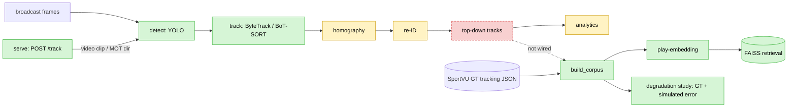

# hooptrack

Reconstruct player-and-ball tracking ("moving dots") from ordinary **NBA broadcast video**, train a
**play-embedding model** on player-and-ball trajectories for similarity retrieval, and wrap both in a
**measured, reproducible eval platform**. The point is the eval rigor and an honest research question, not a
tracking demo (see **What runs today** below — the reconstruction-to-retrieval path is not yet wired end to end):

> **How much do downstream basketball analytics (play retrieval, shot quality) degrade when computed on
> CV-reconstructed tracking versus ground-truth tracking — and which perception errors matter most?**

`hooptrack` is a placeholder name. See `docs/design-doc.md` for the full spec and engineering contract (with
dated amendments) and `docs/increment-0N-*.md` for per-increment writeups. Status: **V1 in progress** — V0
(detection + tracking + eval harness) done and floors locked; the embedding core, FAISS index, the degradation
study, an order-robustness study, and a permutation-invariant encoder are done **on ground-truth tracks**;
remaining V1 is the homography keypoint front-end, re-ID, and wiring the retrieval core to the pipeline output,
then a demo + writeup.

## What runs today

`detect → track` executes end to end on real frames; **everything to the right of `track` is a stub or fed
from ground truth.** Specifically:

- **detect → track — real, end to end.** `pipeline.py` (invoked by `track/run.py` and the eval harness) runs
  YOLO detection → ByteTrack/BoT-SORT tracking on real frames, producing MOT tracks scored by TrackEval. This
  is the only perception path that executes.
- **homography — full stage: a trained keypoint front-end registers frames automatically.** The
  `CourtHomography` stage (inc-05 solver) + a **learned court-keypoint detector** (resnet18 heatmap net,
  `homography.keypoint_weights`) supply correspondences *from a frame image* — no manual calibration. With
  domain augmentation (perspective + photometric), reprojection error **503px floor → 16px median** on
  **held-out arenas** (100% registered; 40px without augmentation). **But it does NOT transfer to broadcast:**
  on SportsMOT it produces ~no confident keypoints (mean peak 0.13), so `court_xy` stays null there. It's
  trained on DeepSportradar **fixed arena cameras** — broadcast registration needs broadcast training data
  (aligned court GT), a fundamental data boundary augmentation can't cross. Default `homography=None`.
- **re-ID — appearance clusters + jersey-number OCR; analytics — real (player-configuration).**
  `reid/identify.py` runs **OSNet appearance re-ID** (`player_id` = cluster `p{k}`) — but appearance can't
  separate same-uniform players (OSNet cosines smear **0.32–0.87, no clean gap**), so with `reid.jersey_ocr`
  it **overlays jersey-number OCR** (easyocr): per track, majority-vote the confident digit reads over crops
  **sampled evenly across the possession** → `player_id` = `#<number>`. Measured by a reproducible harness
  (`make jersey-eval`) on **SportsMOT GT-boxed athletes** (OCR isolated from tracker error; 150 tracks):
  **73% of tracks** get a confident majority number (**47%** with ≥60% cross-frame agreement), from a 16%
  per-crop read rate — plausible jerseys (`#15 #6 #5 #32 #30 #23…`). This is **coverage, not accuracy**
  (SportsMOT has no jersey labels; consensus is the precision proxy) and is the OCR ceiling *given correct
  tracking*. On **real tracker output** (`bytetrack_ft`, HOTA 0.473, `make jersey-eval-tracker`) coverage
  roughly **halves to 0.365** — but only because fragmentation explodes 150 GT ids → **949 tracker-ids**; among
  substantial tracks (≥10 crops) it's **0.56**, and the per-crop read rate is **unchanged (0.16)**. So the drop
  is **association, not OCR** — the same dominant cost inc-07 found. A cheap **fragment-stitching** lever
  (gap-close a player's split ids so votes pool, `make jersey-eval-stitch`) recovers about a third of it: 949 →
  **480 ids**, coverage **0.365 → 0.479**, and crucially consensus **rises** (0.25 → 0.29) — correct same-player
  merges reinforce the vote rather than corrupt it, direct evidence the loss was association and better
  association recovers it (full re-ID / a less-fragmenting tracker would close the rest). An additive ablation attributes the GT lift
  (0.175 → 0.73) to **evidence, not image enhancement**: more crops and even-sampling each ~double coverage;
  CLAHE contrast *hurt*. Tracks without a number fall back to the appearance cluster. `analytics/possessions.py`
  then computes honest **player-configuration** analytics — team spacing + a ball-free transition/halfcourt
  phase segmentation (no ball tracked → no true possessions/shots, stated in the payload), wired into
  `POST /track`. Default `reid=None`.
- **retrieval / play-embedding (the centerpiece) — runs, but fed from ground truth, not the pipeline.**
  `retrieve/` imports none of `detect/`, `track/`, `homography/`, or `pipeline.py`; it is fed exclusively by
  `possessions.build_corpus()` reading SportVU 2015-16 tracking JSON. The reconstructed-vs-GT degradation study
  **simulates** per-stage perception error on those GT tracks — it does not run the perception pipeline.
- **serve — runs the shared detect → track pipeline, from a video clip or a MOT dir.** `POST /track`'s `source`
  is either a **video clip** (decoded to frames by `ingest.extract_frames`, OpenCV) or a prepared MOT sequence,
  and runs the **same `Pipeline` the eval calls** (detect → track), returning **image-coordinate** tracks.
  `court_xy`/`player_id` are null (homography/re-ID off), so these are 2D image boxes, not top-down "moving
  dots". `/health` is a liveness check. No `demo`.

## Results so far (measured, committed to `eval_results/`)

**Perception (V0):** **athlete** detection mAP@50 **0.987** (fine-tuned yolov8m; single class — **ball not
detected**; model-selected on basketball-val, the same split HOTA is scored on, so mildly optimistic; committed
to `eval_results/detection_*.json`) · tracking HOTA **0.301 → 0.473** on SportsMOT basketball-val, via
TrackEval — arc: ByteTrack → BoT-SORT → attribution → detector fine-tune.

The embedding core produced two headline findings — both about limits, both measured:

**(a) The learned encoder is _more fragile_ than a zero-parameter baseline under association error.** In the
reconstructed-vs-GT degradation study, the hand-feature floor beats the trained transformer under **every**
association-error mode: combined realistic budget **floor 0.99 vs trained 0.68**; ID-swaps (id_swap=4)
**floor 0.96 vs trained 0.43**; full player permutation **floor 0.21 vs trained 0.02**. Reconstruction cost
concentrates in **tracking association** (who-is-who over time); homography/detection noise costs ~nothing. The
trained encoder is not the component to trust off broadcast — the association stage is. **The re-ID axis is now
anchored to a _measured_ operating point** (not just a sensitivity sweep): jersey coverage on real tracker
output resolves ~0.56 of players, so ~4 of 10 per possession land in arbitrary slots — folding that into the
realistic budget drops the trained encoder to **0.27 (vs floor 0.89)**. Re-ID, once measured, is the dominant
realistic cost, exactly as inc-07 predicted.

**(b) Order-invariance and temporal-crop robustness are entangled — you cannot have both in this
representation.** Making the encoder order-robust (so it survives association error) collapses temporal-crop
recall from **0.94 → ~0.45–0.49**, while the order-sensitive baseline keeps 0.94. This holds whether the
invariance comes from augmentation (inc-08) or from an _exactly_ permutation-invariant architecture (inc-09):
both routes pay the same crop cost, so it tracks the invariance itself, not the method.

**What the recall number is and is not.** On the same held-out split the trained encoder scores recall@1
**0.62 → 0.98** (floor → trained; court-mirror 0.004 → 0.999). This measures whether an augmented copy of a
possession retrieves _its own original_ under a known augmentation family (jitter / temporal-crop /
court-mirror) — the relevant item for query _i_ is corpus item _i_ itself. It is **instance-level invariance
retrieval, not semantic play similarity**; there are no play-type labels in this repo. The earlier
**0.41 → 0.98** headline is **withdrawn**: 0.41 was computed on a corpus corrupted by the `_game_json`
mtime-duplication bug, and the honest same-split floor is **0.62**.

## Pipeline (what's wired)



**Legend:** green = runs end to end · yellow = real but limited stage (homography auto-registers via a trained
keypoint detector — 16px on held-out arenas, but arena-camera-trained, does NOT transfer to broadcast; re-ID =
appearance clusters + jersey-number OCR, individual identity for ~73% of GT-boxed tracks; analytics =
player-configuration spacing + phases; homography/re-ID `None` by default) · red dashed = stub (top-down
`DOTS` never produced — homography off by default). The retrieval centerpiece is fed from SportVU
**ground truth**, not from `top-down tracks` (the `not wired` edge). **Both** the eval harness and
`serve POST /track` call `pipeline.py` for `detect → track` (the one shared path); homography/re-ID stay
disabled, so both stop at image-coordinate tracks (no top-down "moving dots").

## Quickstart (once implemented)

```
make install         # deps (+ TrackEval from git)
make test            # the real metric tests pass today (34)
make eval            # tracking eval harness -> eval_results/*.json
make retrieve-corpus # build the SportVU possession corpus
make retrieve-floor  # recall@k hand-feature floor (inc-06a)
make retrieve-train  # trained trajectory transformer + FAISS index (inc-06b)
make retrieve-study  # reconstructed-vs-GT degradation study (inc-07)
make serve           # FastAPI service
```

## Layout

Depth concentrates in `retrieve/` (the embedding core) and the degradation
study; the perception stages are competent SOTA integration, not the headline.

## Data & licenses

SportsMOT (HOTA GT), DeepSportradar (CC-BY-NC-ND), SoccerNet Game State Reconstruction (reference), Basketball-51/
NCAA. Broadcast clips are processed locally and never redistributed. If Ultralytics YOLO is used, this repo is
AGPL-3.0.
