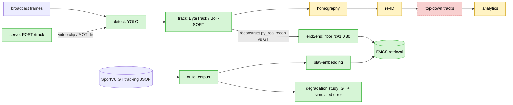

<div align="center">

# 🏀 hoopvec

**Reconstruct player-and-ball tracking from ordinary NBA broadcast video, train a play-embedding model for
similarity retrieval, and wrap both in a measured, reproducible eval platform.**

[](https://github.com/skandula9273/hoopvec/actions/workflows/eval.yml)
[](LICENSE)

[](https://github.com/astral-sh/ruff)


*The point is the eval rigor and an honest research question — not a tracking demo.*

</div>

> **Research question.** How much do downstream basketball analytics (play retrieval) degrade when computed on
> CV-reconstructed tracking versus ground-truth tracking — and *which* perception errors matter most?

📄 **New here? Read [`docs/writeup.md`](docs/writeup.md) first** — the narrative synthesis: the three findings
and the honest real/simulated/gated map, in order. The [Results](#results) table below and the committed JSON in
[`eval_results/`](eval_results/) are the numbers of record.

---

## Contents

- [Highlights](#highlights)
- [Results](#results)
- [What runs today](#what-runs-today)
- [Demo](#demo)
- [Architecture](#architecture)
- [Quickstart](#quickstart)
- [Repository layout](#repository-layout)
- [Data & licenses](#data--licenses)

---

## Highlights

Three measured findings from the embedding core — the intellectual core of the project:

1. **Reconstruction cost concentrates in one stage — tracking association, not per-frame perception.** Jitter
   and dropout cost ~nothing; ID-switches dominate. At a realistic budget the trained encoder falls to
   recall@1 **0.68** (floor 0.99), and to **0.27** once the *measured* re-ID error is folded in. Confirmed
   empirically from three angles (jersey coverage, the end-to-end wire, and the one-clip run).
2. **Order-invariance and temporal-crop robustness are entangled — you can't have both.** Making the encoder
   order-robust collapses crop recall **0.94 → ~0.45**, via *two independent routes* (augmentation and an
   exactly permutation-invariant architecture) — so it tracks the invariance, not the method.
3. **Semantic play retrieval is achievable — but the SSL *objective* was the limitation.** The augmentation-SSL
   encoder is ~random on a play-type axis (0.51); changing **only the objective** to supervised-contrastive
   lifts held-out-game semantic precision@5 to **0.942**. The headline recall@1 0.98 is instance-invariance,
   *not* semantic similarity — a distinction stated everywhere it matters.

**Status: V1 substantially complete + V2 upside measured.** 56 sole-author commits, **106 tests**. Every number
below is a committed, timestamped JSON in [`eval_results/`](eval_results/); the eval harness and the FastAPI
service call the *same* `pipeline.py`, so the numbers describe the deployed system.

---

## Results

*(all measured, committed to `eval_results/`)*

| Stage | Result | Notes |
|---|---|---|
| **Detection** | mAP@50 **0.987** · per-game 0.970–0.991 (std 0.009) | fine-tuned yolov8m, single class; val-selected |
| **Tracking (HOTA)** | **0.301 → 0.473 → 0.525** | ByteTrack → BoT-SORT → detector fine-tune → **imgsz 640** |
| **Homography** | 503px floor → **16px** on held-out arenas | ❗ does **not** transfer to broadcast (data limit) |
| **Ball** | COCO 'sports ball', **~24%** frame coverage | no training; enables partial possessions |
| **Re-ID (jersey)** | coverage **0.73** (GT) / **0.37→0.48** (tracker + stitching) | coverage ≠ accuracy; consensus is the proxy |
| **Retrieval (instance)** | recall@1 floor **0.62 → 0.98** | on SportVU GT; instance-invariance, not semantics |
| **Retrieval (semantic)** | supervised precision@5 **0.942** vs SSL 0.51 ≈ random | derived buckets, not annotated set-plays |
| **End-to-end wire** | real tracker → FAISS, floor r@1 **0.80** | broadcast-domain encoder beats it (0.86 → 0.88) |
| **Serving** | detect→track **9.9 → 21.5 fps** (COCO/1280 → deployed fine-tuned/640) | imgsz 640 dominates 1280; yolov8n on frontier; CoreML EP 2.5× faster than MPS |
| **Uncertainty** | top-1 similarity **calibrated** (corr 0.74, ECE 0.06) | selective prediction 0.82 → ~1.0 |

<details>
<summary><b>The three findings in full (with the numbers)</b></summary>

**(a) The learned encoder is _more fragile_ than a zero-parameter baseline under association error.** In the
reconstructed-vs-GT degradation study, the hand-feature floor beats the trained transformer under **every**
association-error mode: combined realistic budget **floor 0.99 vs trained 0.68**; ID-swaps (id_swap=4)
**floor 0.96 vs trained 0.43**; full player permutation **floor 0.21 vs trained 0.02**. Reconstruction cost
concentrates in **tracking association**; homography/detection noise costs ~nothing. **The re-ID axis is now
anchored to a _measured_ operating point:** jersey coverage on real tracker output resolves ~0.56 of players, so
~4 of 10 per possession land in arbitrary slots — folding that into the realistic budget drops the trained
encoder to **0.27 (vs floor 0.89)**. Re-ID, once measured, is the dominant realistic cost, exactly as inc-07
predicted.

**(b) Order-invariance and temporal-crop robustness are entangled.** Making the encoder order-robust collapses
temporal-crop recall from **0.94 → ~0.45–0.49**, while the order-sensitive baseline keeps 0.94. This holds
whether the invariance comes from augmentation (inc-08) or an _exactly_ permutation-invariant architecture
(inc-09): both routes pay the same crop cost, so it tracks the invariance itself, not the method.

**(c) Semantic play retrieval is achievable — the SSL _objective_ was the limitation.** The augmentation-SSL
encoder sits at ~random on a play-type axis (SSL **0.513** ≈ random 0.496 precision@5). Changing **only the
objective** — same architecture, augmentation, by-game split, seed — to a supervised-contrastive loss lifts
held-out-**game** semantic precision@5 to **0.942** (vs floor 0.597). Honest caveat: the bucket is a derived
proxy (early ball advance), not an annotated set-play — this validates achievability + eval sensitivity, not
play discovery (`make retrieve-semantic-validate`).

**What the recall number is and is not.** On the same held-out split the trained encoder scores recall@1
**0.62 → 0.98** (court-mirror 0.004 → 0.999). This measures whether an augmented copy of a possession retrieves
_its own original_ — **instance-level invariance retrieval, not semantic play similarity** (finding (c) covers
semantics separately). The earlier **0.41 → 0.98** headline is **withdrawn**: 0.41 was on a corpus corrupted by
the `_game_json` mtime-duplication bug; the honest same-split floor is **0.62**.

</details>

<details>
<summary><b>Serving optimization — the V2 Pareto (a real, actionable frontier)</b></summary>

Sweeping the detector's inference `imgsz` turns the 9.9-fps baseline into a measured frontier and shows the
**then-deployed imgsz 1280 is Pareto-dominated**: imgsz **640 gives higher mAP (0.987 vs 0.967) AND 2.6× the fps**,
because the model was fine-tuned at 640 (inferring at 1280 is a train/infer mismatch). Applied + re-measured
HOTA: 640 beats 1280 on **every** tracking metric (HOTA 0.473 → 0.525, DetA/AssA/MOTA/IDF1 all up); re-benching
the deployed detect→track path on the new default lifts end-to-end throughput **9.9 → 21.5 fps** (measured, not
extrapolated — `make serve-bench` now targets `configs/v0_finetuned_640.yaml`). A fine-tuned
**yolov8n** (3.0M params, 6 MB) lands on the frontier at 44.7 fps. **Inference format:** the naive ONNX/CoreML
exports looked slower — but only because onnxruntime defaulted to **CPU**; routing ONNX through the **CoreML
execution provider** (Apple Neural Engine) is **17.7 ms — 2.5× faster than MPS PyTorch** on the forward pass.
`make detect-pareto`, `make onnx-providers`.

</details>

---

## What runs today

`detect → track` executes end to end on real frames; the retrieval core runs on ground-truth tracks with the
**real tracker output now wired in**. Here's the honest per-stage status:

| Stage | Status | One line |
|---|---|---|
| `detect → track` | ✅ **runs** | YOLO → ByteTrack/BoT-SORT on real frames, scored by TrackEval |
| homography | 🟡 arena-only | learned keypoint net (16px on arenas); **no broadcast transfer** |
| re-ID + jersey OCR | 🟡 partial | appearance clusters + jersey coverage 0.73 (GT); off by default |
| ball → possessions | 🟡 partial | COCO 'sports ball' ~24%; true possessions where visible |
| retrieval (centerpiece) | ✅ **runs** | trained on SportVU GT; real tracker output wired via `end2end.py` |
| serve `POST /track` | ✅ **runs** | the shared `Pipeline`; image-coordinate tracks + `/metrics` |

<details>
<summary><b>Full per-stage detail (every caveat)</b></summary>

- **detect → track — real, end to end.** `pipeline.py` (invoked by `track/run.py` and the eval harness) runs
  YOLO detection → ByteTrack/BoT-SORT tracking on real frames, producing MOT tracks scored by TrackEval.
- **homography — a trained keypoint front-end registers frames automatically, on arenas.** A learned
  court-keypoint detector (resnet18 heatmap net) supplies correspondences *from a frame image*. With domain
  augmentation, reprojection error **503px floor → 16px median** on held-out arenas. **But it does NOT transfer
  to broadcast:** on SportsMOT it produces ~no confident keypoints, so `court_xy` stays null — a data boundary
  (needs aligned broadcast court GT). Default `homography=None`.
- **re-ID + jersey OCR + analytics.** OSNet appearance re-ID can't separate same-uniform players (cosines
  0.32–0.87, no clean gap), so `reid.jersey_ocr` overlays jersey-number OCR. Measured on GT-boxed athletes:
  **73%** of tracks get a confident majority number (47% with ≥60% cross-frame agreement). Coverage, not
  accuracy — a synthetic accuracy study shows OCR is ~0.94–1.0 at real jersey heights (median 63px), so the
  loss is **pose/blur/occlusion, not resolution**. On real tracker output coverage halves to 0.365 (pure
  fragmentation, 949 tracker-ids for 150 players); fragment **stitching** recovers a third (→0.48, consensus
  *rises*). Analytics = spacing + ball-free phases, upgraded to **true possessions** when a ball track is
  supplied (COCO 'sports ball', ~24% coverage; shots need a hoop model, stated not faked).
- **retrieval / play-embedding (the centerpiece).** Trained on SportVU 2015-16 GT; the degradation study
  *simulates* perception error on those tracks. The **real tracker output** is now run through the tensor
  adapter + FAISS index (`end2end.py`): reconstructed-vs-GT floor **recall@1 0.80** — a *harder* hit than the
  simulated budget implied. An in-domain **broadcast-domain encoder** beats the floor on a held-out game
  (0.86 → 0.88), so the trained centerpiece can be made valid end to end.
- **ONE fully-honest end-to-end clip (inc-10).** Frames → detect → track → court → tensor → embed → retrieval
  runs on one clip, but the neighbours are **not meaningful** — a hand-clicked homography (~30 ft off) +
  arbitrary player slots + no ball = the degradation study's prediction made empirical. A clean-looking top-5
  would have been *less* honest (`docs/increment-10-end-to-end.md`).
- **serve.** `POST /track` runs the shared `detect → track` pipeline (video clip or MOT dir), returning
  image-coordinate tracks; homography/re-ID off → 2D boxes, not top-down "moving dots". Default detector is the
  Pareto-optimal `configs/v0_finetuned_640.yaml` (falls back to COCO if fine-tuned weights are absent).
  `/health` is liveness; `/metrics` returns serving observability (latency percentiles, throughput, drift).

</details>

---

## Demo

```bash
make demo   # NL query + calibrated similar-play retrieval on SportVU GT, then the honest broadcast limit
```

A reproducible five-minute walkthrough — see [`docs/demo-output.txt`](docs/demo-output.txt) for a full
transcript. It runs the product *where it works* and **names the gap** where it doesn't:

```
[1] Natural-language play query  (text -> semantic constraints -> matching possessions)
  "half court sets on the left"   constraints={'transition':'halfcourt','initiation_side':'left'}  matches=320
  "isolation on the right"        constraints={'initiation_side':'right','handler_change':'handler_low'}  matches=251

[2] Similar-play retrieval with confidence  (top-1 cosine calibrated: corr 0.74 / ECE 0.06)
  query: HOU.at.SAS event 31   confidence=0.903 [HIGH]   -> HOU.at.SAS event 33  (next play, same game)
  query: NOP.at.DAL event 131  confidence=0.643 [LOW (would abstain)]

[3] What does NOT work yet — broadcast reconstruction (honest, measured)
    inc-10 ran ONE clip end-to-end; the neighbours were NOT meaningful (hand-clicked homography + no re-ID).
```

---

## Architecture

One shared pipeline path; the platform layers wrap it.



🟢 runs end to end · 🟡 real but limited (homography arena-only; re-ID = clusters + jersey OCR; both `None` by
default) · 🔴 stub (top-down "moving dots" not produced — homography off by default). The retrieval centerpiece
is **trained** on SportVU GT; `end2end.py` wires the **real tracker output** into the FAISS index in image
coordinates (no broadcast homography). Both the eval harness and `serve` call `pipeline.py` for `detect → track`.

---

## Quickstart

```bash
make install               # deps (+ TrackEval from git)
make test                  # the real metric tests (106 passing)
make demo                  # the honest walkthrough
make eval                  # tracking eval harness -> eval_results/*.json

# --- retrieval core (SportVU corpus) ---
make retrieve-corpus              # build the SportVU possession corpus
make retrieve-train               # trained trajectory transformer + FAISS index (saves a checkpoint)
make retrieve-study               # reconstructed-vs-GT degradation study
make retrieve-semantic-validate   # VALIDATE semantic retrieval: supervised (SupCon) vs floor/SSL/random
make retrieve-end2end             # REAL tracker output -> tensor -> FAISS retrieval (the wired path)
make retrieve-uncertainty         # is retrieval confidence calibrated? selective prediction

# --- serving & perception add-ons ---
make serve-bench                  # serving latency baseline (detect->track fps)
make detect-pareto                # detector accuracy/latency/size Pareto (+ onnx-providers)
make detect-generalization        # per-game detection mAP (cross-game generalization)
make ball-eval / jersey-eval      # ball coverage / jersey-OCR coverage ablation
make serve                        # FastAPI service (POST /track, /metrics)
```

Full target list: `make help`.

---

## Repository layout

```
src/hoopvec/
  pipeline.py     # the ONE shared path (serve + eval call this)
  detect/         # YOLO detector, fine-tune, Pareto, export/format benches
  track/          # ByteTrack / BoT-SORT
  homography/     # court registration (keypoint front-end)
  reid/           # appearance re-ID + jersey OCR + fragment stitching
  analytics/      # possessions, spacing, phases
  retrieve/       # play-embedding core + FAISS + degradation study + uncertainty  (CENTERPIECE)
  serve/          # FastAPI app + observability
  demo.py         # the honest walkthrough
eval_results/     # committed timestamped JSON per run
docs/             # writeup.md · design-doc.md · depth-round-notes.md · increment-0N-*.md
tests/            # 106 CI-safe tests (real metric logic)
```

Depth concentrates in `retrieve/` (the embedding core) and the degradation study; the perception stages are
competent SOTA integration, not the headline.

---

## Data & licenses

- **Data:** SportsMOT (HOTA GT), DeepSportradar (CC-BY-NC-ND), SoccerNet Game State Reconstruction (reference),
  Basketball-51/NCAA, SportVU 2015-16 tracking. Broadcast clips are processed locally and never redistributed.
- **License:** this repo is **[AGPL-3.0](LICENSE)** — using Ultralytics YOLO (AGPL) makes the whole project
  AGPL, a stated decision.
