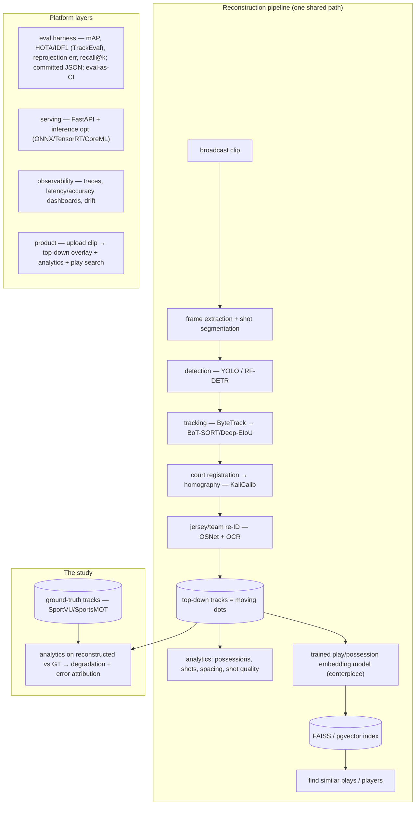

# NBA Broadcast Tracking + Play-Retrieval Platform — Design doc

**Author:** Sai (Santosh Kandula)
**Date:** July 22, 2026
**Status:** Draft v0.1 — **for your approval.** Locks when you sign off; after that, deviations need a dated
amendment with rationale (same rule as the SEC project). Proposed choices below are marked with their reasoning;
genuinely-open calls are collected in **Open decisions** for you to lock.

---

## Project

A platform that **reconstructs player-and-ball tracking ("moving dots") from ordinary NBA broadcast video**,
trains a **play/possession embedding model** on those tracks for similarity retrieval, and wraps both in a
**measured, reproducible evaluation platform**. Two surfaces share one engine, exactly as in the SEC project:

1. **A benchmarked engine** — each perception stage scored on public benchmarks (detection mAP, tracking HOTA on
   SportsMOT, homography reprojection error), and the retrieval core scored with recall@k. The point is *proving
   each design choice against a public number, one variable at a time.*
2. **A live product** — upload a broadcast clip → top-down reconstructed tracking + analytics + "find similar
   plays/players."

The deliverable is not a tracking demo. It's a **measured applied-ML CV system** plus the honest answer to a
research question the open demos never ask (below).

## Problem

NBA "moving dots" tracking comes from proprietary in-arena multi-camera rigs (Second Spectrum, Hawk-Eye) and is
unavailable from a TV broadcast. Open broadcast-tracking projects exist but share two gaps: (a) they don't
**measure** themselves against public tracking benchmarks, and (b) nobody quantifies how much **downstream
analytics degrade** when computed on CV-reconstructed tracking versus ground-truth tracking. Off-the-shelf
perception is treated as if its errors don't propagate — they do.

**The research question that anchors the whole project:**

> *How much do downstream basketball analytics (play retrieval, shot quality) degrade when computed on
> CV-reconstructed tracking versus ground-truth tracking — and which perception errors (tracking, homography,
> identity) matter most?*

You can answer it honestly because you'll have **both** kinds of tracks: the noisy ones this pipeline
reconstructs, and clean ground-truth tracks (SportVU / SportsMOT). The answer is the finding that makes this a
study, not a feature list — the same way the SEC project's value was a measured finding, not the RAG itself.

## Success criteria

The point is a verifiable number per stage and an honest degradation study — not one vanity metric. Floors below
are **provisional and locked after the V0 baseline run** (no fabricated SOTA; report regressions as-is, like the
SEC recall@5 0.44).

| Metric | V0 floor | Target | Source |
|---|---|---|---|
| Player/ball detection (mAP@50) | beat a trivial baseline; report as-is | approach published basketball-detection numbers | DeepSportradar / SportsMOT |
| Multi-object tracking (**HOTA**) | report vs published SportsMOT baselines | competitive with a strong baseline tracker | SportsMOT (via TrackEval) |
| Homography reprojection error (px) | report | within a documented tolerance | DeepSportradar camera-calibration |
| Retrieval (**recall@k**) | set a floor you'll report | beat a nearest-neighbor-on-hand-features baseline | held-out similar-play set |
| Serving latency / FPS | measured | a real-time-ish or on-device number | measured traces |
| **Analytics degradation** (reconstructed vs GT) | measured + explained | quantified, with the dominant error source named | the study |

Headline results: **HOTA** (public, verifiable), **recall@k** (the trained core), and the **degradation study**.

## Architecture

Data flows through the pipeline; the platform layers (eval, serving, observability) wrap it. **The API and the
eval harness call the same pipeline code** — one path, so committed numbers describe the deployed system (the SEC
honesty rule).

## Focus & positioning (honest)

This project is a **signal that you can build and measure production-style ML systems**, aimed at strong new-grad
applied-ML / ML-engineer roles — not a claim of senior-level experience. Two consequences shape the scope:

- **Depth concentrates in two places:** the **trained play-embedding core** and the **reconstructed-vs-GT
  degradation study.** That's where the real ML rigor and a defensible finding live. The perception pipeline
  (detection / tracking / homography / re-ID) is the **enabler** — competent SOTA integration, not the headline.
  Put your deepest work into the core and the study; keep the pipeline solid but don't gold-plate it.
- **The target is finished, measured, and defensible — not maximal.** A complete V1 with a real HOTA number, a
  real study finding, a deployed demo, and a writeup beats an unfinished, more-ambitious build. Over-scoping is
  the failure mode here, not under-ambition.

## Scope

Executed as **individually-measured increments, one variable at a time** against a committed baseline — the same
methodology that made the SEC ablation table trustworthy. The V0 line is a **proposal**; adjust it to taste.

**In scope.** NBA/basketball broadcast → 2D top-down tracking; a trained play-embedding retrieval core; a
measured eval platform; the reconstructed-vs-GT degradation study.

**Out of scope (V2+ / never without a told-to).** Real-time multi-camera fusion; a full 3D reconstruction
(monocular-3D is a *possible* V2 bolt-on, not V0/V1); non-basketball sports; commercial use (see the AGPL note).

- **V0 (proposed).** Detection + tracking + **HOTA on SportsMOT** + the eval harness + committed JSON. The
  smallest slice that produces a *verifiable public number* and stands up the measured platform. No homography,
  no retrieval yet.
- **V1 — the finish line (the portfolio deliverable).** Court homography + re-ID → full top-down reconstruction;
  the **trained embedding core + retrieval recall@k**; the **reconstructed-vs-GT degradation study** (the
  finding); a deployed demo + a technical writeup. This is what "done" means — the target you ship.
- **V2 — upside only, if V1 ships clean.** Serving + inference optimization (ONNX/TensorRT/CoreML; the
  accuracy–latency–size **Pareto frontier**); observability; product UI; end-to-end uncertainty; an NL query
  layer; a monocular-3D bolt-on. Real, but not the plan — added only after V1 is finished and measured.

**Drift rules.** No new stage before the current one is measured; no backbone swap mid-baseline; the eval harness
(TrackEval + W&B) stands up **before** any modeling; no product polish ahead of a verifiable number.

---

## Tech stack (and the two decisions that need your call)

| Component | Proposed choice | Reason | Your decision |
|---|---|---|---|
| Language | Python 3.11 | standard for this stack | — |
| Detection | **YOLO (Ultralytics)** for V0 | fast, documented, exports to **CoreML** (Apple angle) | **YOLO (AGPL) vs RF-DETR (Apache-2.0, better generalization) vs YOLOX (MIT)** — license + generalization tradeoff |
| Tracking | **ByteTrack** V0 baseline | simplest tracking-by-detection; reproducible floor | upgrade to **BoT-SORT / Deep-EIoU** as a measured ablation (Kalman-only underperforms on sports; motion+appearance fusion wins) |
| Court homography | **KaliCalib**-style keypoints + OpenCV DLT | purpose-built for basketball courts | SegFormer camera-params as alt |
| Re-ID / jersey | **OSNet** + a scene-text OCR (DBNet+PARSeq) | standard sports ReID; OCR for numbers | SOLIDER as ReID upgrade |
| Embedding core | **trajectory transformer**, self-supervised | see "The trained core" | baller2vec encoder as alt |
| Eval | **TrackEval** (HOTA/MOTA/IDF1) + custom harness | field-standard, fast | — |
| Retrieval index | **FAISS** or **pgvector** | you know pgvector from SEC | — |
| Serving | FastAPI + **ONNX/TensorRT/CoreML** | inference optimization = Apple/systems signal | — |
| Experiment tracking | **Weights & Biases**; YAML-config ablations | one variable at a time | — |
| Deploy / CI | Docker; a GPU host; GitHub Actions + **eval-as-CI** | the system grades itself on every change | — |

**AGPL note (real, not cosmetic):** Ultralytics YOLO is AGPL-3.0 → using it means the whole repo is AGPL
(fine for an open portfolio; blocks future commercialization). If that matters, RF-DETR (Apache) or YOLOX (MIT)
avoid it. This is a genuine design decision — state your choice and reason in the doc.

## The trained core (the centerpiece)

A **play/possession embedding model** — the piece where your ML-modeling depth, retrieval identity, and eval
rigor all come forward. It's a real, published problem, so it's a legitimate centerpiece, not a bolt-on.

- **What:** a neural encoder that maps a possession (all players + ball trajectories over a segment) to a vector,
  so similar plays land near each other. "Find similar plays/players" = nearest-neighbor search over the vectors.
- **Architecture (proposed):** a trajectory/temporal transformer over the possession's tracks (or the baller2vec
  multi-entity encoder).
- **Objective (proposed):** self-supervised / contrastive — augment a possession (temporal crop, court mirror,
  jitter) as positives, other possessions as negatives; or play2vec-style denoising reconstruction; or
  masked-trajectory prediction. No labels required.
- **Eval:** retrieval **recall@k / mAP** against a held-out similar-play set (proxy labels = same play-type from
  the action datasets, or a small hand-labeled "same set-play" set — labeling scheme is an open decision).
- **Prior art to build on:** play2vec, SimPlay, HoopTransformer (SSL on NBA trajectories), TrajSV, UniTE.

## Eval design

Three reads, all reproducible, all honest about their boundary:

1. **Per-stage, on public ground truth (verifiable):** detection mAP; tracking **HOTA/AssA/IDF1** via TrackEval on
   SportsMOT; homography reprojection error on DeepSportradar; retrieval recall@k on the held-out set.
2. **Full pipeline, on real broadcast (qualitative):** there are **no perfectly-aligned broadcast↔GT-tracking
   pairs**, so the end-to-end reconstruction is shown qualitatively and spot-checked — stated explicitly as the
   eval boundary, not hidden.
3. **The degradation study (the finding):** run play retrieval + shot quality on reconstructed vs ground-truth
   tracks, quantify the gap, and attribute it to the dominant perception-error source. Calibration where
   probabilities are produced; walk-forward / no-lookahead where anything is temporal.

Ablations are config-driven, one variable at a time, each committed as timestamped JSON — and the eval runs in CI.

## Reproducibility commitments

Fixed seeds; pinned lockfile; committed timestamped eval JSON per run; config-driven ablations (`configs/*.yaml`);
one-command reproduce (`make eval`); W&B run logs; sole-author git history. One shared pipeline path for API and
eval so committed numbers describe the deployed system.

## Known failure modes — surface, don't hide

- **Jersey-number ID is the least reliable stage** (motion blur, small text, occlusion) — don't over-promise
  identity accuracy.
- **Homography failures** on unusual camera angles/cuts propagate to every downstream number.
- **No aligned broadcast↔GT pairs** — the eval boundary above; the honest limitation of the whole approach.
- **Similar-play ground truth is partly self-constructed** — the labeling scheme must be stated plainly.
- **Scope** — a multi-stage pipeline plus a trained model is large; the increment discipline is the guardrail.
- **AGPL** if Ultralytics is used — an explicit, on-record constraint.

## Open decisions (close before lock — your calls)

1. **Project / repo name** (this working title is a placeholder).
2. **Detector:** YOLO (AGPL, CoreML, fast) vs RF-DETR (Apache, generalization) vs YOLOX (MIT).
3. **The V0 line:** is it detection + tracking + HOTA (proposed), or a thinner/thicker first slice?
4. **Embedding-core architecture** (trajectory transformer vs baller2vec) and the **similar-play labeling scheme**.
5. **Which elevators are in scope:** the degradation study is in (it's the spine); Pareto frontier, end-to-end
   uncertainty, and the NL query layer are optional — your call on V2.
6. **Success-criteria floors** — lock after the V0 baseline run.

## References (read-first order)

- **SoccerNet Game State Reconstruction** (arXiv 2404.11335) + `SoccerNet/sn-trackeval` — the reference task; the
  2024 winner stack (YOLOv5m + SegFormer + DeepSORT + jersey) is your baseline recipe.
- **SportsMOT** (arXiv 2304.05170, `MCG-NJU/SportsMOT`) + **TrackEval** (`JonathonLuiten/TrackEval`) — dataset +
  HOTA benchmark.
- **KaliCalib** (arXiv 2209.07795) — court registration. **Ultralytics** docs — training/export/tracker configs.
- **play2vec**, **SimPlay**, **HoopTransformer**, **TrajSV**, **UniTE** — the embedding-core lineage.
- **DeepSportradar** (arXiv 2208.08190) — detection/segmentation/calibration/re-ID + challenges.

## Workflow note

The engineering discipline is fixed: one variable at a time, honest numbers, no fake APIs, reproducible,
dated amendments, sole-author history. Every increment ends in a committed metric against a public benchmark,
with eval-as-CI. The measure of progress is *a measured, defensible increment* — every change reviewed and
every choice defensible, because that understanding is what the work is for.

---

*Living document. Versioned in repo. Updates noted at top with date and rationale. Locks on your approval.*

